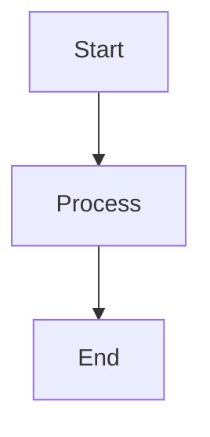
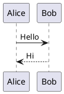

~~~md
---
layout: default
background: white
---
~~~

# 1. Core Slidev Markdown syntax

## Slide separator

```md
# Slide 1

Content

---

# Slide 2

Content
```

**Annotation**
- `---` on its own line separates one slide from the next.
- The first `--- ... ---` block at the very start of the file is headmatter.
- Later `--- ... ---` blocks immediately after a separator are per-slide frontmatter.

---

## Headmatter

```md

theme: default
title: My Presentation


# First slide
```

**Annotation**
- The first frontmatter block is called **headmatter**.
- It configures the whole presentation.

---

## Per-slide frontmatter

```md

layout: center
background: /image.jpg
class: text-white


# A configured slide
```

**Annotation**
- Per-slide frontmatter changes one slide only.
- It can set layout, background, transition, click count, zoom and other slide-level settings.

---

## Block frontmatter

```md
```yaml
layout: center
background: /image.jpg
```

# Slide content
```

**Annotation**
- A YAML code block can be used as frontmatter.
- This exists for better compatibility with Markdown formatters.

---

## Presenter notes

```md
# Slide title

Visible content

<!--
These are presenter notes.
They are not part of the normal slide content.
-->
```

---

## Importing slides

```md
---
src: ./other-slides.md
---
```

Specific slides:

```md
---
src: ./other-slides.md#2,5-7
---
```

**Annotation**
- `src` imports another Slidev Markdown file.
- A range can select particular slides from that file.

---

## Frontmatter merging

When an imported slide has its own frontmatter and the importing entry also provides frontmatter, Slidev merges them. The main entry takes precedence for conflicting values.

---

# 2. Standard Markdown usable in Slidev

```md
# Heading 1
## Heading 2
### Heading 3

**bold**
*italic*
~~strikethrough~~

- bullet
- bullet

1. numbered
2. numbered

[Link](https://example.com)


> Block quote

`inline code`

---

Horizontal rule
```

Slidev supports normal Markdown plus Slidev-specific syntax, inline HTML, Vue components and UnoCSS classes.

---

# 3. HTML in slides

```html
<div>
  HTML content
</div>
```

With inline styling:

```html
<div style="font-size: 40px;">
  Large text
</div>
```

---

# 4. UnoCSS styling

```html
<div class="text-4xl font-bold text-center">
  Styled content
</div>
```

Example positioning:

```html
<div class="absolute top-10 left-10">
  Positioned content
</div>
```

---

# 5. Scoped CSS inside a slide

```html
<style>
h1 {
  font-size: 3rem;
}
</style>
```

**Annotation**
- A `<style>` block inside a slide can style that slide.
- Project-wide CSS can also be placed in the Slidev styles files.

---

# 6. Vue expressions and components

```md
<div>{{ 1 + 2 }}</div>
```

```md
<MyComponent />
```

Components can come from:
1. Slidev built-ins
2. the active theme
3. addons
4. `./components/`

No manual import is required for auto-imported components.

---

# 7. Click animations

## v-click

```html
<div v-click>
  Appears on the next click
</div>
```

---

## Ordered click numbers

```html
<div v-click="1">First</div>
<div v-click="2">Second</div>
<div v-click="3">Third</div>
```

---

## v-click.hide

```html
<div v-click.hide>
  Visible first, then hidden on click
</div>
```

---

## v-after

```html
<div v-click>
  Appears first
</div>

<div v-after>
  Appears at the same click stage as the previous v-click
</div>
```

---

## VClick component

```html
<VClick>
  Appears on click
</VClick>
```

---

## VClicks component

```md
<VClicks>

- First item
- Second item
- Third item

</VClicks>
```

**Annotation**
- Child items are revealed one by one.

---

## v-clicks directive

```html
<ul v-clicks>
  <li>First</li>
  <li>Second</li>
  <li>Third</li>
</ul>
```

---

## Per-slide click count

```yaml

clicks: 5
clicksStart: 0

```

- `clicks` defines the total click stages for a slide.
- `clicksStart` sets the initial click number.

---

# 8. VSwitch

```html
<VSwitch>
  <template #1>
    State 1
  </template>

  <template #2>
    State 2
  </template>

  <template #3>
    State 3
  </template>
</VSwitch>
```

**Annotation**
- Displays different content at different click stages.

---

# 9. Navigation direction styling

```html
<div class="forward:delay-300">
  Different styling can be applied when moving forward.
</div>
```

Slidev supports navigation-direction variants so styling/animation can react differently to forward and backward navigation.

---

# 10. Rough-marker animations

Examples:

```html
<span v-mark.underline>Underline</span>
```

```html
<span v-mark.circle>Circle</span>
```

Rough-marker directives visually annotate content during click animations.

---

# 11. Slide transitions

```yaml

transition: fade

```

Directional transitions:

```yaml

transition: slide-left

```

A forward/backward variant can also be expressed with a transition value that changes by navigation direction.

---

# 12. Code blocks

```md
```ts
console.log('Hello')
```
```

Slidev uses Shiki for syntax highlighting.

---

# 13. Code line highlighting

Static line highlighting:

```md
```ts {2,3}
const a = 1
const b = 2
const c = 3
```
```

Click-based highlighting:

```md
```ts {1|2-3|all}
const a = 1
const b = 2
const c = 3
```
```

**Annotation**
- Each section separated by `|` is another click stage.
- `all` highlights the whole block.

---

# 14. Code line numbers

Deck-wide:

```yaml
---
lineNumbers: true
---
```

Individual code block:

```md
```ts {lines:true}
const value = 10
```
```

---

# 15. Maximum code-block height / scrolling

```md
```ts {maxHeight:'100px'}
const a = 1
const b = 2
const c = 3
```
```


# 16. Import code snippets from files

```md
<<< @/snippets/example.js
```

Explicit language:

```md
<<< @/snippets/example.js js
```

Region:

```md
<<< @/snippets/example.js#region-name
```

With code features:

```md
<<< @/snippets/example.js {2,3|5}{lines:true}
```

Monaco:

```md
<<< @/snippets/example.js ts {monaco}{height:200px}
```

---

# 17. Code groups

Requires Comark.

```yaml

comark: true

```

```md
::code-group

```ts [TypeScript]
const value: number = 1
```

```js [JavaScript]
const value = 1
```

::
```

**Annotation**
- Groups several code blocks into tabs.
- Titles can be used to identify each tab.

---

# 18. Monaco editor

```md
```ts {monaco}
const answer = 42
```
```

**Annotation**
- Turns a code block into an editable Monaco editor.


# 19. Monaco run

```md
```ts {monaco-run}
console.log('Hello from Slidev')
```
```

**Annotation**
- Creates a runnable Monaco code block when supported by the configured code runner.

---

# 20. Monaco write

```md
<<< ./example.ts {monaco-write}
```

**Annotation**
- Exposes a file in Monaco so changes can be written to that file during development.

---

# 21. Magic Move code animation

```md
````md magic-move
```ts
const value = 1
```

```ts
const value = 2
console.log(value)
```
````
```

**Annotation**
- Animates changes between code states.

---

# 22. Twoslash

Deck-wide:

```yaml
---
twoslash: true
---
```

Per block:

```md
```ts twoslash
const message: string = 'Hello'
```
```

**Annotation**
- Adds TypeScript-aware information to code examples.

---

# 23. Mermaid diagrams

```md

```

---

# 24. PlantUML diagrams

```md

```

PlantUML server configuration:

```yaml
---
plantUmlServer: https://www.plantuml.com/plantuml
---
```

---

# 25. LaTeX

Inline:

```md
$\sqrt{3x-1}+(1+x)^2$
```

Block:

```md
$$
E = mc^2
$$
```

---

# 26. Icons

```html
<mdi-home />
```

Slidev supports icons from Iconify-compatible open-source icon sets through auto-imported icon components.

---

# 27. Comark syntax

Enable it:

```yaml
---
comark: true
---
```

Example styled content:

```md
Some text {style="color:red"}
```

Comark adds component- and style-oriented Markdown syntax.

---

# 28. Draggable elements

Directive form:

```html
<div v-drag>
  Drag me
</div>
```

Component form:

```html
<VDrag pos="myElement">
  Drag me
</VDrag>
```

Stored positions:

```yaml
---
dragPos:
  myElement: 100,50,200,100,0
---
```

The values represent left, top, width, height and rotation.

---

# 29. Drawing and annotations

Deck configuration:

```yaml
---
drawings:
  enabled: true
  persist: false
  presenterOnly: false
  syncAll: true
---
```

Slidev includes drawing/annotation mode for marking over slides.

---

# 30. Click markers in presenter notes

```md
<!--
Explain the first point.

[click]

Explain the second point.

[click]

Explain the third point.
-->
```

**Annotation**
- `[click]` splits presenter notes into click-linked sections.
- Notes can highlight/scroll as click stages change.

---

# 31. Global layers

Special Vue files can render persistent content around every slide.

Examples:

```text
global-top.vue
global-bottom.vue
```

Use them for persistent overlays, branding, headers, footers or controls.

---

# 32. Slide hooks

```ts
onSlideEnter(() => {
  // Runs when the slide is entered.
})

onSlideLeave(() => {
  // Runs when the slide is left.
})
```

---

# 33. Navigation API

```ts
const nav = useNav()
```

Slidev exposes navigation state/actions through `$nav` and `useNav()`.

It also exposes Slidev global context through `$slidev`.

---

# 34. Built-in component: Link

```html
<Link to="5">
  Go to slide 5
</Link>
```

Route alias:

```html
<Link to="intro">
  Go to intro
</Link>
```

---

# 35. Built-in component: SlideCurrentNo

```html
<SlideCurrentNo />
```

---

# 36. Built-in component: SlidesTotal

```html
<SlidesTotal />
```

Combined:

```html
Slide <SlideCurrentNo /> of <SlidesTotal />
```

---

# 37. Built-in component: Toc

```html
<Toc />
```

```html
<Toc maxDepth="2" />
```

```html
<Toc columns="2" />
```

Documented props include:

```text
columns
maxDepth
minDepth
mode
```

Documented `mode` values:

```text
all
onlyCurrentTree
onlySiblings
```

---

# 38. Built-in component: TitleRenderer

```html
<TitleRenderer no="3" />
```

Renders the configured/inferred title for a slide.

---

# 39. Built-in component: Arrow

```html
<Arrow x1="10" y1="20" x2="100" y2="200" />
```

Two-way arrow:

```html
<Arrow
  x1="10"
  y1="20"
  x2="100"
  y2="200"
  two-way
/>
```

Documented props:

```text
x1
y1
x2
y2
width
color
two-way
```

---

# 40. Built-in component: VDragArrow

```html
<VDragArrow />
```

A draggable Arrow component.

---

# 41. Built-in component: Transform

```html
<Transform :scale="0.5">
  <div>Scaled content</div>
</Transform>
```

Documented props:

```text
scale
origin
```

---

# 42. Built-in component: AutoFitText

```html
<AutoFitText
  :max="200"
  :min="50"
  modelValue="Hello"
/>
```

Automatically adjusts text size within limits.

---

# 43. Built-in component: SlidevVideo

```html
<SlidevVideo autoplay controls>
  <source src="/video.mp4" type="video/mp4" />
</SlidevVideo>
```

Can be combined with click animation:

```html
<SlidevVideo v-click autoplay controls>
  <source src="/video.mp4" type="video/mp4" />
</SlidevVideo>
```

Documented props include:

```text
controls
autoplay
autoreset
poster
timestamp
```

---

# 44. Built-in component: Youtube

```html
<Youtube id="dQw4w9WgXcQ" />
```

Custom dimensions:

```html
<Youtube
  id="dQw4w9WgXcQ"
  width="600"
  height="400"
/>
```

---

# 45. Built-in component: Tweet

By ID:

```html
<Tweet id="1423789844234231808" />
```

Scaled:

```html
<Tweet
  id="1423789844234231808"
  :scale="0.8"
/>
```

By URL:

```html
<Tweet url="https://x.com/antfu7/status/1389604687502995457" />
```

- `id` or a full `x.com` / `twitter.com` post URL can be used.
- If both are present, `id` takes precedence.

---

# 46. Built-in component: LightOrDark

```html
<LightOrDark>
  <template #dark>
    Dark mode content
  </template>

  <template #light>
    Light mode content
  </template>
</LightOrDark>
```

---

# 47. Built-in component: RenderWhen

```html
<RenderWhen context="presenter">
  Only in presenter mode
</RenderWhen>
```

Documented contexts:

```text
main
visible
print
slide
overview
presenter
previewNext
```

---

# 48. Built-in component: PoweredBySlidev

```html
<PoweredBySlidev />
```

---

# 49. Built-in layout: default

```yaml
---
layout: default
---
```

Standard slide layout.

---

# 50. Built-in layout: center

```yaml
---
layout: center
---
```

Centers content horizontally and vertically.

---

# 51. Built-in layout: cover

```yaml
---
layout: cover
---
```

Cover/title slide.

---

# 52. Built-in layout: end

```yaml
---
layout: end
---
```

End slide.

---

# 53. Built-in layout: full

```yaml
---
layout: full
---
```

Full-space slide with no normal layout padding.

---

# 54. Built-in layout: none

```yaml
---
layout: none
---
```

No built-in layout styling.

---

# 55. Built-in layout: intro

```yaml
---
layout: intro
---
```

Introduction slide.

---

# 56. Built-in layout: quote

```yaml
---
layout: quote
---
```

Prominent quotation layout.

---

# 57. Built-in layout: section

```yaml
---
layout: section
---
```

Section-divider slide.

---

# 58. Built-in layout: statement

```yaml
---
layout: statement
---
```

Prominent statement/affirmation.

---

# 59. Built-in layout: fact

```yaml
---
layout: fact
---
```

Prominent fact/data slide.

---

# 60. Built-in layout: two-cols

```md
---
layout: two-cols
---

# Left

Left content

::right::

# Right

Right content
```

---

# 61. Built-in layout: two-cols-header

```md
---
layout: two-cols-header
---

# Header

::left::

Left content

::right::

Right content
```

---

# 62. Built-in layout: image

```yaml
---
layout: image
image: /photo.jpg
backgroundSize: cover
---
```

---

# 63. Built-in layout: image-left

```md
---
layout: image-left
image: /photo.jpg
class: my-class
---

# Content on the right
```

---

# 64. Built-in layout: image-right

```md
---
layout: image-right
image: /photo.jpg
---

# Content on the left
```

Image-layout properties include:

```text
image
class
backgroundSize
```

---

# 65. Built-in layout: iframe

```yaml
---
layout: iframe
url: https://example.com
---
```

---

# 66. Built-in layout: iframe-left

```md
---
layout: iframe-left
url: https://example.com
---

# Content on the right
```

---

# 67. Built-in layout: iframe-right

```md
---
layout: iframe-right
url: https://example.com
---

# Content on the left
```

---

# 68. Custom layouts

Create:

```text
layouts/my-layout.vue
```

Example:

```vue
<template>
  <div class="slidev-layout my-layout">
    <slot />
  </div>
</template>

<style scoped>
.my-layout {
  display: flex;
  align-items: center;
  justify-content: center;
}
</style>
```

Use it:

```yaml
---
layout: my-layout
---
```

---

# 69. Custom layout named slots

Layout:

```vue
<template>
  <div class="slidev-layout two-areas">
    <div class="top">
      <slot name="top" />
    </div>

    <div class="bottom">
      <slot />
    </div>
  </div>
</template>
```

Slide:

```md
---
layout: two-areas
---

::top::

Top content

::default::

Bottom content
```

---

# 70. Layout loading order

Slidev's documented layout loading order is:

```text
1. Slidev default layouts
2. Theme layouts
3. Addon layouts
4. Custom layouts in ./layouts/
```

Later sources can override earlier ones.

---

# 71. Slide canvas size

```yaml
---
aspectRatio: 16/9
canvasWidth: 980
---
```

---

# 72. Slide zoom

```yaml
---
zoom: 0.8
---
```

`0.8` displays content at 80% scale.

---

# 73. Background

```yaml
---
background: /image.jpg
backgroundSize: cover
class: text-white
---
```

---

# 74. Hide / disable a slide

```yaml
---
disabled: true
---
```

or:

```yaml
---
hide: true
---
```

---

# 75. Table-of-contents metadata

```yaml
---
hideInToc: true
level: 2
title: Custom Title
---
```

- `hideInToc` removes the slide from `<Toc>`.
- `level` overrides the title level.
- `title` overrides the slide title used by Slidev.

---

# 76. Route alias

```yaml
---
routeAlias: intro
---
```

The slide can then be addressed using `intro` rather than only its slide number.

---

# 77. Preload

```yaml
---
preload: false
---
```

Controls whether the slide is mounted before it is entered.

---

# 78. Theme

```yaml
---
theme: default
---
```

Other installed theme packages or local theme paths can be supplied.

---

# 79. Addons

```yaml
---
addons:
  - excalidraw
  - '@slidev/plugin-notes'
---
```

---

# 80. Theme configuration

```yaml
---
themeConfig:
  primary: '#5d8392'
---
```

The accepted options inside `themeConfig` depend on the active theme.

---

# 81. Default frontmatter for all slides

```yaml
---
defaults:
  layout: default
  transition: fade
---
```

---

# 82. Colour schema

```yaml
---
colorSchema: auto
---
```

Documented values:

```text
auto
light
dark
```

---

# 83. Favicon

```yaml
---
favicon: /favicon.ico
---
```

---

# 84. Fonts

```yaml
---
fonts:
  sans: Roboto
  serif: Roboto Slab
  mono: Fira Code
  provider: google
---
```

Documented provider values include:

```text
google
none
```

---

# 85. Highlighter

```yaml
---
highlighter: shiki
---
```

---

# 86. Monaco configuration switch

```yaml
---
monaco: true
---
```

The official reference documents support for:

```text
true
dev
build
```

---

# 87. Twoslash configuration switch

```yaml
---
twoslash: true
---
```

---

# 88. Monaco type source

```yaml
---
monacoTypesSource: local
---
```

Documented values:

```text
local
cdn
none
```

---

# 89. Recording

```yaml
---
record: dev
---
```

Slidev includes presentation recording support.

In the UI, recording/camera controls are available from presenter controls; the official reference also documents the `G` shortcut for the camera/recording UI.

---

# 90. Selectable text

```yaml
---
selectable: true
---
```

---

# 91. Context menu

```yaml
---
contextMenu: true
---
```

---

# 92. Wake lock

```yaml
---
wakeLock: true
---
```

Prevents the screen from sleeping while presenting where supported.

---

# 93. PDF download in built site

```yaml
---
download: true
---
```

---

# 94. Export filename

```yaml
---
exportFilename: slides
---
```

---

# 95. Export configuration

```yaml
---
export:
  format: pdf
  timeout: 30000
  withClicks: false
  withToc: false
---
```

---

# 96. Presentation title

```yaml
---
title: My Presentation
---
```

---

# 97. Web-page title template

```yaml
---
titleTemplate: '%s - Slidev'
---
```

`%s` is replaced by the presentation title.

---

# 98. Author

```yaml
---
author: Your Name
---
```

---

# 99. Keywords

```yaml
---
keywords: slidev, presentation
---
```

---

# 100. Info

```yaml
---
info: |
  ## About
  Presentation description
---
```

---

# 101. SEO metadata

```yaml
---
seoMeta:
  ogTitle: Presentation Title
  ogDescription: Description
  ogImage: https://example.com/og.png
  ogUrl: https://example.com
  twitterCard: summary_large_image
  twitterTitle: Title
  twitterDescription: Description
  twitterImage: https://example.com/twitter.png
---
```

---

# 102. Open Graph image

```yaml
---
seoMeta:
  ogImage: https://example.com/og.png
---
```

A project `og-image.png` can also be used by Slidev for the social preview image.

---

# 103. HTML attributes

```yaml
---
htmlAttrs:
  dir: ltr
  lang: en
---
```

---

# 104. Presenter mode configuration

```yaml
---
presenter: true
---
```

The official reference documents support for:

```text
true
dev
build
```

---

# 105. Browser exporter

```yaml
---
browserExporter: dev
---
```

The official reference documents the browser exporter as a build/dev configurable feature.

---

# 106. Router mode

```yaml
---
routerMode: history
---
```

Documented values:

```text
history
hash
```

---

# 107. Remote assets

```yaml
---
remoteAssets: false
---
```

Slidev can download/bundle remote assets when building.

---

# 108. Generate PDF when building

Headmatter:

```yaml
---
download: true
---
```

CLI:

```bash
slidev build --download
```

This includes a downloadable PDF with the built presentation.

---

# 109. Presenter timer

Example deck configuration:

```yaml
---
duration: 30min
timer: countdown
---
```

Slidev presenter mode includes timer support.

---

# 110. Remote control

```bash
slidev --remote
```

With a password:

```bash
slidev --remote mypassword
```

This exposes remote presentation control.

---

# 111. Presenter-note automatic Ruby support

```yaml
---
notesAutoRuby: true
---
```

Slidev supports automatic Ruby-text handling in presenter notes.

---

# 112. Side editor

Slidev includes an in-browser side editor accessible from its editor control.

There is no Markdown syntax required to turn this on for ordinary development use.

---

# 113. VS Code extension

Extension identifier:

```text
antfu.slidev
```

Documented capabilities include:
- slide preview in the side panel
- slide tree with slide numbers
- drag-and-drop slide reordering
- folding for slide blocks
- multiple Slidev projects
- starting the dev server
- AI/Copilot integration through Language Model Tools

---

# 114. Prettier support

Package:

```text
prettier-plugin-slidev
```

Slidev also supports block frontmatter to avoid conflicts with generic Markdown formatting.

---

# 115. MCP server

CLI:

```bash
slidev mcp
```

With a running development server, Slidev also exposes an HTTP MCP endpoint:

```text
http://localhost:<port>/__mcp
```

This is for AI agents to inspect and edit presentations.

---

# 116. Eject a theme

```bash
slidev theme eject
```

Custom output directory:

```bash
slidev theme eject --dir theme
```

Override which theme is ejected:

```bash
slidev theme eject --theme seriph
```

---

# 117. CLI: development server

```bash
slidev [entry]
```

Example:

```bash
slidev slides.md
```

Documented options:

```text
--port
--open
--remote [password]
--bind
--base
--log
--force
--theme
```

Examples:

```bash
slidev --port 8080 --open
slidev --remote mypassword
slidev --base /talks/my-talk/
```

---

# 118. CLI: build

```bash
slidev build [entry]
```

Documented options:

```text
--out
--base
--download
--theme
--without-notes
```

Examples:

```bash
slidev build --base /my-repo/
slidev build --download --out public
slidev build slides1.md slides2.md
```

---

# 119. CLI: export

```bash
slidev export [entry]
```

Documented options:

```text
--output
--format
--timeout
--range
--dark
--with-clicks
--with-toc
--wait
--wait-until
--omit-background
--executable-path
```

Documented formats include:

```text
pdf
png
pptx
md
```

Examples:

```bash
slidev export
slidev export --format pptx
slidev export --format png --range 1-5
slidev export --with-clicks --dark
slidev export --timeout 60000 --wait 2000
```

Exporting PDF/PPTX/PNG requires the browser export dependency used by Slidev, commonly installed as:

```bash
pnpm add -D playwright-chromium
```

---

# 120. CLI: format

```bash
slidev format [entry]
```

Formats the Slidev Markdown file structure.

---

# 121. CLI: MCP

```bash
slidev mcp [entry]
```

Starts the MCP server over stdio.

---

# 122. CLI: theme eject

```bash
slidev theme eject [entry]
```

Documented options:

```text
--dir
--theme
```

---

# 123. CLI boolean negation

```bash
slidev --open
```

```bash
slidev --no-open
```

Slidev's CLI supports the normal positive/negative boolean option form.

---

# 124. Install Slidev CLI globally

```bash
npm i -g @slidev/cli
```

---

# 125. npm scripts

```json
{
  "scripts": {
    "dev": "slidev",
    "build": "slidev build",
    "export": "slidev export"
  }
}
```

Passing arguments:

```bash
npm run dev -- --port 8080 --open
npm run export -- --format pptx
```

---

# 126. Static-site hosting

Build:

```bash
slidev build
```

The generated static application can be deployed to a web host.

Base path example:

```bash
slidev build --base /my-repo/
```

---

# 127. Bundle/cache remote assets

```yaml
---
remoteAssets: true
---
```

Slidev can retrieve and bundle supported remote assets for the built presentation.

---

# 128. Build without presenter notes

```bash
slidev build --without-notes
```

---

# 129. Export click stages

```bash
slidev export --with-clicks
```

Creates exported pages/states for click animations.

---

# 130. Export a slide range

```bash
slidev export --range 1,4-7
```

---

# 131. Export dark mode

```bash
slidev export --dark
```

---

# 132. Export PDF table of contents

```bash
slidev export --with-toc
```

---

# 133. Transparent export background

```bash
slidev export --omit-background
```

---

# 134. Custom export timeout

```bash
slidev export --timeout 60000
```

---

# 135. Wait before export

```bash
slidev export --wait 2000
```

---

# 136. Custom browser executable for export

```bash
slidev export --executable-path /path/to/browser
```

---

# 137. Multiple presentation builds

```bash
slidev build slides1.md slides2.md
```

---

# 138. Custom Vite configuration

Slidev allows Vite configuration through the project configuration hooks/files.

Use this when adding or changing Vite plugins and Vite behaviour for the presentation application.

---

# 139. Custom Vue application configuration

Slidev allows the Vue application to be configured so plugins, components or app-level behaviour can be registered.

---

# 140. Custom UnoCSS configuration

Slidev allows UnoCSS configuration for custom presets, rules, shortcuts and styling behaviour.

---

# 141. Custom Shiki/highlighter configuration

Slidev allows the built-in code highlighter to be configured, including Shiki-related behaviour.

---

# 142. Configure code runners

Slidev supports configurable code runners for runnable code features such as Monaco Run.

---

# 143. Configure transformers

Slidev exposes transformer configuration for transforming parsed slide content.

---

# 144. Configure Monaco

Slidev allows Monaco-specific options and setup to be customised.

---

# 145. Configure KaTeX

Slidev allows KaTeX configuration for mathematical rendering.

---

# 146. Configure Mermaid

Slidev allows Mermaid configuration for diagram behaviour.

---

# 147. Configure Mermaid renderer

Slidev allows the Mermaid renderer to be replaced/configured.

---

# 148. Configure routes

Slidev allows additional/custom application routes to be configured.

---

# 149. Configure shortcuts

Slidev allows keyboard shortcuts to be customised.

---

# 150. Configure context menu

Slidev allows the presentation context menu to be customised.

---

# 151. Configure fonts

Deck-level example:

```yaml
---
fonts:
  sans: Roboto
  serif: Roboto Slab
  mono: Fira Code
  provider: google
---
```

Slidev also provides a dedicated font configuration system for project-wide font handling.

---

# 152. Configure pre-parser

Slidev supports a pre-parser hook/configuration stage that can alter source content before normal Slidev parsing.

---

# 153. Theme creation

A Slidev theme can provide or override:
- layouts
- components
- styles
- configuration defaults

Themes can be installed as packages or referenced by a local path.

---

# 154. Addon creation

Slidev addons can extend a deck with reusable functionality such as:
- components
- layouts
- configuration
- integrations

---

# 155. Custom components

Place Vue components in:

```text
components/
```

Example:

```vue
<template>
  <div class="my-component">
    Hello
  </div>
</template>
```

Use directly in Markdown:

```html
<MyComponent />
```

---

# 156. Directory-based customisation

Slidev recognises conventional project directories/files for custom:
- components
- layouts
- styles
- configuration
- setup code
- public/static assets

The official documentation's **Directory Structure** reference defines the exact supported paths for the installed Slidev version.

---

# 157. White background slide — minimal reusable version

This is the smallest practical explicit white slide:

```md
---
layout: default
background: white
---
```

Nothing else is needed inside the slide.

---

# 158. One white slide with no visible content

```md
---
layout: default
background: white
---
```

This is the template used at the very top of this file.

---

# Official references checked

- https://sli.dev/guide/syntax
- https://sli.dev/features/
- https://sli.dev/builtin/layouts
- https://sli.dev/builtin/components
- https://sli.dev/custom/
- https://sli.dev/builtin/cli
- https://github.com/slidevjs/slidev/blob/main/skills/slidev/SKILL.md
- https://github.com/slidevjs/slidev/blob/main/skills/slidev/references/core-headmatter.md
- https://github.com/slidevjs/slidev/blob/main/skills/slidev/references/core-frontmatter.md
- https://github.com/slidevjs/slidev/blob/main/skills/slidev/references/core-components.md
- https://github.com/slidevjs/slidev/blob/main/skills/slidev/references/core-layouts.md
- https://github.com/slidevjs/slidev/blob/main/skills/slidev/references/core-cli.md
