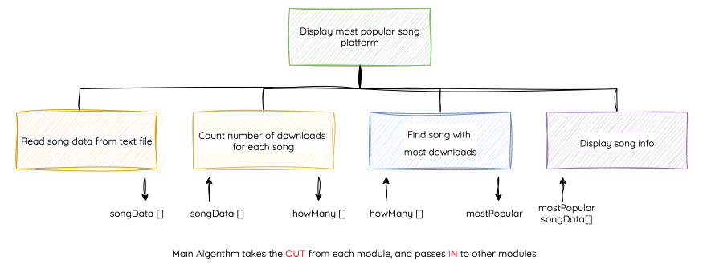

# Structure Diagrams

!!! info "What You Need to Know"

    You must be able to read, understand, create, and implement designs using **structure diagrams**.

<center>
<iframe width="560" height="315" src="https://www.youtube.com/embed/1Kd9ji1b-nI?si=R6Ne-OpBshpYifjR" title="YouTube video player" frameborder="0" allow="accelerometer; autoplay; clipboard-write; encrypted-media; gyroscope; picture-in-picture; web-share" referrerpolicy="strict-origin-when-cross-origin" allowfullscreen></iframe>
</center>

## Purpose

A **structure diagram** shows how a program is broken into modules.

Each box represents one task. The highest level shows the main parts of the program, and lower levels show how those parts are refined into smaller tasks.

Structure diagrams are useful when you want to see the overall organisation of a program before thinking about detailed code.

## National 5 to Higher

At National 5, a structure diagram usually shows the main parts of a program.

For example:

```text
Quiz Program
+-- Get answers
+-- Calculate score
+-- Display score
```

This is useful because it shows the program broken down into smaller tasks.

At Higher, the structure diagram needs to show more design detail. It should make it clear:

- what the main modules are
- what data each module needs
- what data each module produces
- which modules have been refined into smaller tasks
- how the modules could become procedures or functions in the final program

| National 5 structure diagram | Higher structure diagram |
|---|---|
| Shows the main tasks in the program | Shows the main modules in the program |
| Focuses on breaking the problem down | Also shows data flow between modules |
| May stop at the top-level design | Often includes refinements for complex modules |
| Helps plan the order of tasks | Helps plan procedures, functions, and parameters |

The key difference is that Higher structure diagrams are not just about naming the tasks. They should also show how data moves through the design.

## Reading a Structure Diagram

When reading a structure diagram, look for:

- the overall problem at the top
- the main modules below it
- any smaller tasks below a module
- data flow labels or arrows

The example below shows a program that finds and displays the most-downloaded song on a streaming platform.

<figure markdown="span">
  { width="1200" }
</figure>

## Showing Data Flow

At Higher, data flow can be added to a structure diagram using labels or arrows.

<figure markdown="span">
  { width="800" }
</figure>

Use:

- `IN` for data passed into a module
- `OUT` for data passed out of a module

For a more detailed explanation of what counts as data flow, see [Data Flow In and Out](3.1.3-data-flow-in-out.md).

## Data Flow Tables

If the diagram becomes crowded, the same information can be shown in a table.

<figure markdown="span">
  { width="450" }
</figure>

Tables are often clearer when several arrays or variables move between modules.

## Showing Refinements

A **refinement** breaks a module into smaller tasks.

You use refinements when a module is too broad and needs more detail before it could be implemented.

<figure markdown="span">
  { width="800" }
</figure>

The smaller tasks below the module show how that module will work. They do not need to be full program code.

At Higher, refinements are useful because a top-level module may be too general on its own. Breaking it into smaller steps makes the design clearer for the programmer.

For example, a module called `Find most-downloaded song` might be refined into:

```text
Find most-downloaded song
+-- Set top position to first song
+-- Loop through remaining songs
+-- Compare current downloads with top downloads
+-- Update top position if current song is higher
```

This gives enough detail to understand the logic, but it still stays at the design stage.

You do not need to refine every module. A module only needs refinement if the task is complex or unclear.

## Check Your Diagram

A good Higher structure diagram should make these questions easy to answer:

- What are the main modules?
- What data does each module need?
- What data does each module produce?
- Which modules have been refined?
- Could the modules become procedures or functions?

!!! tip "Higher exam tip"

    If your diagram only lists the main tasks, it may look more like a National 5 answer.

    To make it stronger for Higher, add data flow and refinements where they are needed.

## Summary

Structure diagrams show how a program is broken into modules.

At National 5, a structure diagram often shows the main tasks in a program. At Higher, it should show more design detail, especially data flow and refinements.

A good Higher structure diagram should show:

- the main modules in the program
- any smaller tasks used to refine complex modules
- the data that goes into each module
- the data that comes out of each module
- how the modules could become procedures or functions

The key difference is that a Higher structure diagram should not just list tasks. It should help another programmer understand how the solution is organised and what data moves between the parts of the program.
