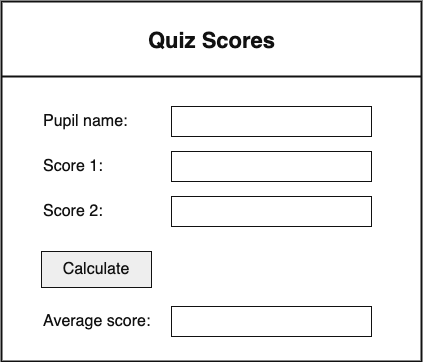

# Wireframes

!!! info "What You Need to Know"

    You must be able to design user interfaces using **wireframes**.

## Purpose

A **wireframe** is a simple design for a user interface.

It shows the layout of a screen before the final program is built. A wireframe is not meant to be a finished visual design. It should focus on what the user will see and how the user will interact with the program.

Wireframes help developers plan:

- what information the user must enter
- what buttons or controls the user will need
- where outputs will be displayed
- how the screen will support the functional requirements

## Wireframes and Analysis

A wireframe should be based on the analysis stage.

The analysis identifies the program's inputs, processes, and outputs. The wireframe should show how the user interface will support these.

| Analysis item | What the wireframe should show |
|---|---|
| Input | Where the user enters or selects data |
| Process | The button or control that starts an action |
| Output | Where the result or message will be displayed |

For example, if the analysis says the user must enter two scores and view an average, the wireframe should include:

- two score input boxes
- a calculate button
- an output area for the average

## What to Include

A good Higher wireframe may show:

- headings
- labels
- input boxes
- buttons
- menus or drop-down lists
- checkboxes or radio buttons
- output areas
- error or message areas
- the general screen layout

The wireframe should make it clear how the user will complete the main tasks in the program.

## What Not to Worry About

A wireframe does not need to show the final appearance of the program.

You do not need to include:

- colours
- fonts
- images
- exact spacing
- decorative styling

The main purpose is to show the layout and the interface elements, not the final graphic design.

## Example Wireframe

The example below shows a simple screen for entering quiz scores and displaying an average.

<figure markdown="span">
  { width="400" }
</figure>

This wireframe shows:

- where the user enters the pupil name and scores
- the button used to start the calculation
- where the average score will be displayed

## Checking a Wireframe

When checking a wireframe, ask:

- Can the user enter all required inputs?
- Can the user start the required processes?
- Can the user see the required outputs?
- Are labels clear enough for the user to understand?
- Does the layout match the functional requirements?

If an input, process, or output from the analysis is missing, the wireframe is incomplete.

## Checklist

A good Higher wireframe should:

- show the main parts of the screen clearly
- include all required inputs and outputs
- include buttons or controls for important actions
- use clear labels
- match the functional requirements
- be simple and easy to understand
- avoid unnecessary decoration

## Summary

Wireframes are used to design the layout of a user interface before implementation begins.

At Higher, a wireframe should link clearly to the analysis. It should show how the user will enter data, start processes, and view outputs.

A good wireframe does not need to look like the finished program. It should clearly show the interface elements needed to meet the functional requirements.
