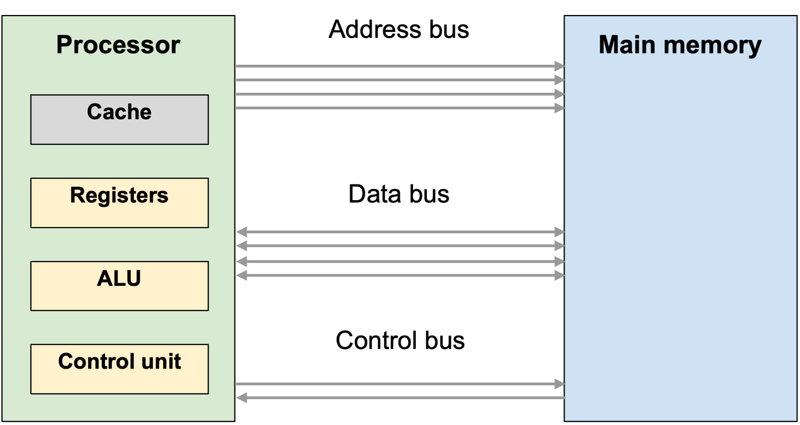

# Computer Architecture

!!! info "What you need to know"

    **Describe the purpose of the processor, memory, storage, input and output devices.**

    **Describe the role of the control unit, arithmetic and logic unit, registers, cache and system buses.**

Computer architecture describes the components of a computer system and how they work together to run programs.

Computers come in many forms, but they all follow the same basic pattern:

1. **Input** enters the system.
2. The **processor** works on the data by following instructions.
3. **Memory** holds the programs and data currently being used.
4. **Storage** keeps programs and data for later.
5. **Output** presents the result.

For example, when you edit a photo, the image may be loaded from storage into memory. The processor follows the photo-editing program's instructions to change the image, and the updated image is shown on the screen as output.

## Input and output

Data can move into a computer system, out of a computer system, or both. This depends on the type of device being used.

=== "Input"

    An **input device** sends data or instructions into a computer system.

    Examples include:

    - a keyboard sending key presses;
    - a microphone sending sound data;
    - a camera sending image or video data; and
    - a mouse sending movement and click data.

=== "Output"

    An **output device** presents processed data from a computer system.

    Examples include:

    - a monitor displaying text, images and video;
    - a speaker playing sound; and
    - a printer producing a physical copy.

=== "Both"

    Some devices perform both roles.

    For example, a touchscreen is an **output device** because it displays images and text. It is also an **input device** because it detects taps, swipes and gestures.

    A network interface also performs both roles because it sends and receives data.

=== "Comparison"

    The key difference is the **direction of data flow**:

    | Device type | Direction | Example |
    | --- | --- | --- |
    | **Input** | Into the computer | Typing a password on a keyboard |
    | **Output** | Out of the computer | Showing a message on a monitor |

## The processor

The **central processing unit (CPU)** is the part of the computer that executes program instructions and controls the computer's operation.

The processor does not normally store whole programs permanently. Instead, it works on small pieces of data and instructions at very high speed.

In simple terms, the processor:

1. gets an instruction from memory;
2. works out what the instruction means;
3. carries out the instruction; and
4. moves on to the next instruction.

It contains several important components.

=== "Control unit"

    The **control unit (CU)** coordinates the processor's activities.

    It decodes instructions and sends control signals to other components. It does not usually perform calculations itself. Its job is to direct the other parts of the processor.

    For example, the control unit can signal that data should be read from memory, copied into a register, or sent to the ALU.

=== "ALU"

    The **arithmetic and logic unit (ALU)** performs calculations, comparisons and logical operations.

    Arithmetic operations include:

    - addition;
    - subtraction;
    - multiplication; and
    - division.

    Logical operations include:

    - comparing two values;
    - checking whether a condition is true or false; and
    - using logic operations such as AND, OR and NOT.

    For example, if a program checks whether a user's score is greater than 50, the comparison is carried out by the ALU.

=== "Registers"

    **Registers** are very small, very fast storage locations inside the processor. They hold the values the processor needs immediately.

    Registers are faster than cache, RAM and secondary storage, but there are only a small number of them.

    !!! note "Why registers matter"

        The processor cannot work directly on every item in RAM at once. Registers hold the current instruction, address or data value so the processor can use it immediately.

=== "PC and IR"

    Different registers have specific jobs:

    | Register | Purpose |
    | --- | --- |
    | **Program counter (PC)** | Stores the address of the next instruction to fetch from memory. |
    | **Instruction register (IR)** | Stores the instruction currently being decoded or executed. |

=== "Summary"

    | Component | Purpose |
    | --- | --- |
    | **Control unit (CU)** | Coordinates the processor's activities. It decodes instructions and sends control signals to other components. |
    | **Arithmetic and logic unit (ALU)** | Performs calculations, comparisons and logical operations. |
    | **Registers** | Very small, fast storage locations inside the processor that hold current instructions, addresses and data. |

## Memory and storage

Memory and storage both hold programs and data, but they are used for different purposes.

**Main memory** stores the programs and data that the processor needs to access directly. **Secondary storage** keeps programs and data when the power is switched off.

=== "RAM"

    **Random access memory (RAM)** is the computer's working memory. It stores the programs and data currently being used.

    When a program is running, its instructions and current data are held in RAM. The processor can then fetch instructions and data from memory as needed.

    For example, when you open a web browser, the browser program is loaded into RAM. The web pages, images and tabs you are using are also stored in RAM while they are needed.

    RAM is **volatile**, which means its contents are lost when the power is switched off.

=== "ROM"

    **Read-only memory (ROM)** stores instructions or data that should not be lost when the computer is switched off. It is **non-volatile**.

    ROM is often used to store firmware: permanent instructions used to start the computer and prepare it to load the operating system.

=== "Secondary storage"

    **Secondary storage** keeps programs and data when the power is switched off.

    Examples include:

    - solid-state drives;
    - hard disk drives; and
    - memory cards.

    Storage has a much larger capacity than RAM and is non-volatile, but the processor cannot execute instructions directly from it. A program must first be loaded from storage into RAM.

=== "Comparison"

    | Feature | Main memory | Secondary storage |
    | --- | --- | --- |
    | Main purpose | Holds programs and data currently in use | Keeps programs and data for later |
    | Speed | Faster | Slower |
    | Capacity | Smaller | Larger |
    | Volatility | RAM is volatile; ROM is non-volatile | Non-volatile |
    | Example | Open apps and current files | Saved documents, installed apps and the operating system |

    !!! note "Memory speed"

        RAM is normally much faster than secondary storage, but it is still slower than registers and cache.

=== "Opening a file"

    When you open a saved document, it is read from secondary storage and copied into RAM.

    The processor then works with the copy in RAM while the document is open. When you save the document, the updated version is written back to secondary storage.

## System buses

A **bus** is a collection of parallel lines used to carry signals between components.

Buses connect the processor, memory and input/output devices. They allow addresses, data and control signals to move around the computer system.

=== "Address bus"

    The **address bus** carries the address of the memory location or input/output port being accessed.

    It normally carries addresses from the processor to other components.

    The address bus identifies **where** a transfer should happen.

=== "Data bus"

    The **data bus** carries data and instructions.

    It is **bidirectional**, which means data can travel to or from the processor.

    The data bus carries **what** is being transferred.

=== "Control bus"

    The **control bus** carries control signals, such as read, write and timing signals.

    It is **bidirectional**, which means signals travel between the processor and other components.

    The control bus tells the other components what kind of action should happen.

=== "Example transfer"

    To read an instruction from memory:

    1. The processor places the memory address on the **address bus**.
    2. The processor sends a read signal on the **control bus**.
    3. The instruction stored at that address travels back to the processor on the **data bus**.

=== "Summary"

    | Bus | Purpose | Direction |
    | --- | --- | --- |
    | **Address bus** | Carries the address of the memory location or input/output port being accessed. | Normally from the processor to other components. |
    | **Data bus** | Carries data and instructions. | Bidirectional: data can travel to or from the processor. |
    | **Control bus** | Carries control signals such as read, write and timing signals. | Bidirectional: signals travel between the processor and other components. |

    The three buses work together. The address bus alone is not enough because it only identifies a location. The data bus alone is not enough because the system also needs to know where the data is coming from or going to.

## Cache memory

**Cache** (pronounced *cash*) is a small amount of very fast memory located in or close to the processor. It stores copies of frequently or recently used instructions and data, reducing the time the processor spends waiting for RAM.

Cache is useful because processors are much faster than RAM. Without cache, the processor may spend more time waiting for data and instructions to arrive from memory.

=== "Purpose"

    Cache stores copies of frequently or recently used instructions and data.

    This reduces the time the processor spends waiting for RAM.

=== "How it works"

    When the processor needs data or an instruction:

    1. It checks cache first.
    2. If the item is in cache, it can be accessed quickly.
    3. If the item is not in cache, it must be fetched from RAM.

=== "Example"

    If a program repeats the same calculation many times, the same instructions may be needed again and again.

    Cache can keep copies of those instructions close to the processor, so they can be fetched more quickly.

Cache is explored in more detail in [Factors Affecting System Performance](3.3-system-performance.md).

## How the parts work together

The components in a computer system do not work separately. They cooperate every time a program runs.

For example, when a user opens an app:

1. The app is loaded from **secondary storage** into **RAM**.
2. The **processor** fetches instructions from RAM.
3. The **control unit** coordinates each instruction.
4. The **ALU** performs any required calculations or comparisons.
5. **Registers** hold the current instructions, addresses and data being used immediately.
6. **Cache** stores copies of frequently used instructions and data to reduce waiting time.
7. The **buses** carry addresses, data and control signals between components.
8. **Output devices** present the result to the user.

!!! note "Exam focus"

    For this topic, make sure you can describe the purpose of each component and explain how the processor, memory, storage and buses work together.
